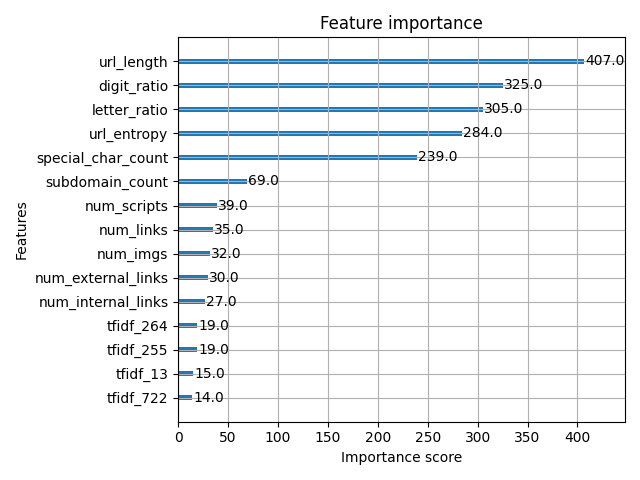

# XGBoost Feature Importance Report

This report summarizes the most important features for the phishing detection model trained on the combined URL and HTML features.

## Feature Importance Plot

> **Interpretation:**
> - Features at the top of the plot are the most influential in the model's decision-making.
> - URL-based features often dominate, but HTML features may also appear if they provide useful signal for phishing detection.
> - Use this information to guide further feature engineering or to explain your model in reports and presentations.

## Top 15 Features Table

See `feature_importance_report.md` for a markdown table of the top 15 features and their importance scores.

---

**To regenerate this report:**
1. Run `04_xgboost_html_model.py` after training a new model.
2. The plot and markdown will be automatically updated.
