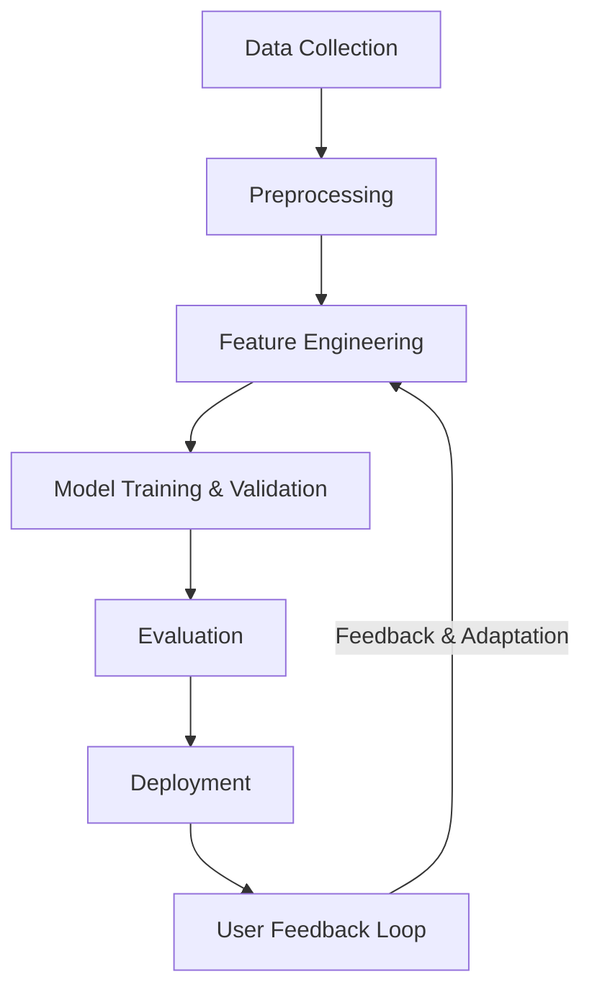

# Adaptive Phishing Detection Using Machine Learning

### TABLE OF CONTENT

DECLARATION	iii  
DEDICATION	iv  
ACKNOWLEDGMENTS	v  
ABSTRACT	vi  
TABLE OF CONTENT	vii  
LIST OF FIGURES	ix  
LIST OF TABLES	x  
LIST OF ABBREVIATIONS	xi  

#### Chapter 1 - Introduction	1  

1.1 Background of Study	1  
1.2 Problem Statement	1  
1.3 Objectives	1  
1.4 Outline of Methodology	1  
1.5 Justification	1  
1.6 Outline of Dissertation	1  

#### Chapter 2 - Literature Review	2  

2.1 Introduction	2  
2.2 Phishing Detection Techniques	2  
2.2.1 Preprocessing Techniques	2  
2.2.2 Feature Engineering	2  
2.2.3 Machine Learning Algorithms	2  

#### Chapter 3 - Methodology	4  

3.1 Overview	4  
3.2 Data Collection	4  
3.3 Analysis Techniques	4  
3.4 Model Development	4  
3.5 User Feedback Integration	4  

#### Chapter 4 – Proposed Model	5  

4.1 Machine Learning-Driven Detection	5  
4.2 Dataset Preparation	5  
4.3 Feature Engineering	5  
4.4 Model Selection and Evaluation	5  

#### Chapter 5 – Results and Discussion	6  

5.1 Evaluation of Model	6  
5.2 Detection Accuracy	6  
5.3 Comparison with Existing Systems	6  

#### Chapter 6 – Conclusion and Future Works	7  

6.1 Conclusion	7  
6.2 Future Works	7  

#### Chapter 7 - Research Timeline	9  

---

### Chapter 1 - Introduction

#### 1.1 Background of Study

Phishing attacks are among the most persistent and damaging forms of cybercrime, exploiting both technical vulnerabilities and human psychology to deceive individuals into divulging sensitive information such as login credentials and financial data ([Mosa et al., 2023](#mosa2023); [Opara et al., 2024](#opara2024)). These attacks leverage sophisticated emails, websites, and instant messages that impersonate trusted organizations, using tactics such as spoofing, domain squatting, and URL obfuscation to evade detection ([Karim et al., 2023](#karim2023); [Atawneh & Aljehani, 2023](#atawneh2023)).

The threat landscape has evolved with the emergence of advanced phishing techniques, including spear phishing (targeting specific individuals), whaling (targeting high-profile executives), vishing (voice phishing), and smishing (SMS phishing), all of which expand the attack surface and challenge traditional security solutions ([Gholampour & Verma, 2023](#gholampour2023); [Hassan, 2024](#hassan2024)). Attackers exploit weaknesses in email protocols, browser vulnerabilities, and user behavior, often automating campaigns using readily available phishing kits ([Doshi et al., 2023](#doshi2023); Al-Subaiey et al., 2024).

Recent years have seen a surge in the use of machine learning and AI by both attackers and defenders, increasing the complexity and sophistication of phishing schemes ([Gholampour & Verma, 2023](#gholampour2023)). The proliferation of digital communications and online transactions has amplified the impact of phishing, resulting in significant financial losses, data breaches, and reputational harm ([Mosa et al., 2023](#mosa2023); [Doshi et al., 2023](#doshi2023)). Phishing remains a leading vector for cyber incidents globally, highlighting the urgent need for adaptive, robust, and scalable detection mechanisms that leverage advanced machine learning techniques ([Karim et al., 2023](#karim2023); Linh et al., 2024).

To address these evolving challenges, the development of adaptive phishing detection models is essential. Such models require comprehensive datasets, advanced feature engineering, and the integration of state-of-the-art machine learning algorithms to enhance detection accuracy and adaptability to emerging threats (Goud & Mathur, 2021; [Liu et al., 2021](#liu2021)).

#### 1.2 Problem Statement

Despite notable progress in phishing detection, phishing attacks continue to evolve and evade existing defenses due to limitations such as reliance on outdated or narrow datasets ([Alzubaidi et al., 2021](#alzubaidi2021); Gupta & Nayak, 2020), insufficient integration of diverse features—including URL, HTML, and behavioral characteristics (Wang et al., 2021; Ali et al., 2021), and machine learning models that often suffer from high false positive rates and poor adaptability to new threats (Jain & Rahman, 2020; [Alzubaidi et al., 2021](#alzubaidi2021)). These challenges result in detection systems that are neither robust nor scalable enough to address the dynamic and sophisticated nature of modern phishing attacks. Therefore, there is a pressing need for a comprehensive, machine learning-based approach that leverages diverse datasets, advanced feature engineering, and rigorous evaluation to significantly improve detection accuracy, reduce false positives, and ensure adaptability to emerging phishing techniques.

Addressing these challenges requires a systematic approach that integrates preprocessing, advanced feature engineering, machine learning optimization, and user feedback integration ([Alzubaidi et al., 2021](#alzubaidi2021); Wang et al., 2021; Ali et al., 2021). This research aims to bridge these gaps by proposing an adaptive phishing detection model that leverages state-of-the-art machine learning techniques to improve detection accuracy and efficiency, as highlighted in recent literature (Jain & Rahman, 2020; [Alzubaidi et al., 2021](#alzubaidi2021)).

#### 1.3 Objectives

The objectives of this research are as follows:

1. **To develop and validate a machine learning-based phishing detection model that achieves at least 95% accuracy and a false positive rate below 3% on benchmark and real-world datasets.**

2. **To design and implement advanced feature engineering methods—including URL, HTML, and behavioral features—demonstrating a measurable improvement (minimum 5% increase in F1-score) over baseline models.**

3. **To deploy and evaluate the adaptive phishing detection system in a simulated real-time environment, measuring scalability and adaptability to new phishing tactics, with successful completion of all evaluation metrics.**

#### 1.4 Outline of Methodology

The methodology for this research is designed to systematically achieve the stated objectives through the following steps:

1. **Model Development and Validation:** Collect and preprocess comprehensive phishing and legitimate datasets from both benchmark and real-world sources. Train a machine learning-based phishing detection model and rigorously validate its performance, targeting at least 95% accuracy and a false positive rate below 3%.

2. **Advanced Feature Engineering:** Design and implement advanced feature extraction methods, including URL, HTML, and behavioral features. Evaluate the impact of these features on model performance, aiming for a minimum 5% improvement in F1-score over baseline models.

3. **Deployment and Real-Time Evaluation:** Deploy the adaptive phishing detection system in a simulated real-time environment. Assess the system’s scalability and adaptability to new phishing tactics, ensuring all evaluation metrics are successfully met.

This methodology ensures a structured and outcome-driven approach to developing a robust, accurate, and adaptive phishing detection solution.

---

### Chapter 2 - Literature Review

#### 2.1 Literature Review

Phishing detection research has rapidly evolved, with a diverse array of machine learning and deep learning approaches proposed in recent years. This review synthesizes findings from a broad set of studies, organized around the three core objectives of this research: model development and validation, advanced feature engineering, and deployment with real-time evaluation.

**1. Model Development and Validation**

Numerous studies have demonstrated the effectiveness of various machine learning and deep learning models for phishing detection. For instance, [Mosa et al., 2023](#mosa2023) compared Neural Networks, Naïve Bayes, and Adaboost, achieving up to 95.43% accuracy, while [Karim et al., 2023](#karim2023) introduced a hybrid voting-based model that reached 99.55% accuracy with third-party features. Deep learning models such as CNN, LSTM, and BERT have also shown high performance in email phishing detection ([Atawneh & Aljehani, 2023](#atawneh2023); [Hassan, 2024](#hassan2024)), with accuracies exceeding 97%. The use of ensemble and hybrid models is a recurring theme, as seen in [Doshi et al., 2023](#doshi2023) and Chinta et al., 2025, who report F1-scores above 99% using dual-layer and BERT-LSTM architectures, respectively. However, studies such as [Misra & Rayz, 2022](#misra2022) and [Gholampour & Verma, 2023](#gholampour2023) highlight the importance of robustness and generalizability, noting that models can overfit to specific datasets and suffer performance drops on out-of-domain or adversarial samples.

Data diversity and validation strategies are critical. Many works utilize publicly available datasets (e.g., PhishTank, Kaggle, Enron, SpamAssassin), but others aggregate data from multiple sources or generate synthetic/adversarial samples to test model resilience ([Gholampour & Verma, 2023](#gholampour2023); [Opara et al., 2024](#opara2024)). Cross-validation, holdout testing, and comparison with baseline models are standard, with metrics such as accuracy, precision, recall, F1-score, and MCC widely reported (Linh et al., 2024; Aljofey et al., 2022).

**2. Advanced Feature Engineering**

Feature engineering remains a cornerstone of high-performing phishing detection systems. Traditional approaches focus on URL-based features (e.g., length, special characters, domain age), but recent studies incorporate HTML content, email headers, third-party reputation, and behavioral signals (Goud & Mathur, 2021; Aljofey et al., 2022; [Opara et al., 2024](#opara2024)). Recursive feature elimination, genetic algorithms, and principal component analysis are employed to select the most relevant features and reduce dimensionality (Kocyigit et al., 2024; Tanimu et al., 2024).

Several studies demonstrate that advanced feature engineering can yield measurable improvements in model performance. For example, Yang et al., 2021 and [Liu et al., 2021](#liu2021) integrate surface, topological, and deep features, reporting improved detection accuracy and faster training times. Swapna Goud & Mathur, 2021 and Wazirali et al., 2021 show that optimal feature selection enhances both accuracy and computational efficiency. However, limitations remain regarding feature generalizability, computational cost, and the need for frequent updates to counter evolving phishing tactics ([Mehdi Gholampour & Verma, 2023](#gholampour2023); Al-Subaiey et al., 2024).

**3. Deployment and Real-Time Evaluation**

Real-world deployment and real-time evaluation are increasingly emphasized in the literature. Linh et al., 2024 developed a browser extension for real-time URL classification using CNNs, achieving 98.4% accuracy. [Doshi et al., 2023](#doshi2023) and Al-Subaiey et al., 2024 implemented web-based and dual-layer architectures, addressing challenges of scalability and adaptability. Studies such as Purwanto et al., 2022 and [Liu et al., 2021](#liu2021) propose feature-free and multistage detection frameworks for rapid and robust detection in practical environments.

Adversarial robustness and adaptability to new phishing tactics are also explored. [Gholampour & Verma, 2023](#gholampour2023) generated adversarial email samples to test model defenses, while [Opara et al., 2024](#opara2024) and Aljofey et al., 2022 highlight the need for continuous model updates and evaluation on diverse datasets. Despite high reported accuracies, many authors note limitations in scalability, computational requirements, and the risk of performance degradation as phishing techniques evolve ([Mehdi Gholampour & Verma, 2023](#gholampour2023); Linh et al., 2024).

**Summary and Gaps**

The literature demonstrates substantial progress in phishing detection, with high-performing models, advanced feature engineering, and real-world deployments. However, persistent challenges include ensuring dataset diversity, feature robustness, adversarial resilience, and practical scalability. This research builds upon these findings by developing and validating a machine learning-based phishing detection system that leverages advanced feature engineering and is evaluated in both benchmark and real-world scenarios, addressing gaps identified across the reviewed literature.

---

### Chapter 3 - Methodology

#### 3.1 Overview
This chapter outlines the systematic methodology adopted to achieve the research objectives: (1) developing and validating a high-performing phishing detection model, (2) designing advanced feature engineering techniques, and (3) deploying and evaluating the model in a real-time environment. The approach is grounded in best practices and recommendations from recent literature ([Mosa et al., 2023](#mosa2023); [Karim et al., 2023](#karim2023); [Doshi et al., 2023](#doshi2023)).

#### 3.2 Data Collection
- **Sources:** Publicly available phishing and legitimate datasets, such as PhishTank, Kaggle, Enron, SpamAssassin, IWSPA, and others ([Mosa et al., 2023](#mosa2023); [Opara et al., 2024](#opara2024); [Atawneh & Aljehani, 2023](#atawneh2023)).
- **Data Types:** URLs, emails, HTML content, and associated metadata.
- **Preprocessing:** Data cleaning (deduplication, normalization), handling missing values, and balancing datasets using augmentation techniques like SMOTE or ADASYN to address class imbalance (Yang et al., 2021; [Gholampour & Verma, 2023](#gholampour2023)).

#### 3.3 Feature Engineering
- **Feature Types:** Extraction of URL-based features (length, special characters, domain age), HTML features, email headers/content, third-party reputation, and behavioral indicators (Goud & Mathur, 2021; Aljofey et al., 2022; [Opara et al., 2024](#opara2024)).
- **Selection/Extraction:** Use of recursive feature elimination, genetic algorithms, principal component analysis, and embedding methods for deep learning (Kocyigit et al., 2024; Tanimu et al., 2024; [Atawneh & Aljehani, 2023](#atawneh2023)).
- **Justification:** Advanced feature engineering is shown to improve detection accuracy and model robustness ([Liu et al., 2021](#liu2021); Swapna Goud & Mathur, 2021).

#### 3.4 Model Development
- **Algorithms:** Implementation and comparison of machine learning (Random Forest, SVM, XGBoost) and deep learning models (CNN, LSTM, BERT, hybrid/ensemble architectures) ([Doshi et al., 2023](#doshi2023); Chinta et al., 2025; [Hassan, 2024](#hassan2024)).
- **Training:** Model training using cross-validation, hyperparameter tuning (grid/random search), and comparison with baseline models.
- **Tools:** Python, scikit-learn, TensorFlow, Keras, PyTorch.

#### 3.5 Model Evaluation
- **Metrics:** Accuracy, precision, recall, F1-score, MCC, ROC-AUC (Linh et al., 2024; Aljofey et al., 2022).
- **Validation:** Holdout test sets, k-fold cross-validation, and, where possible, adversarial and out-of-domain samples to assess robustness ([Gholampour & Verma, 2023](#gholampour2023); [Misra & Rayz, 2022](#misra2022)).

#### 3.6 Deployment and Real-Time Evaluation
- **Deployment:** Simulated real-time environment or browser extension for live URL/email classification (Linh et al., 2024; Al-Subaiey et al., 2024).
- **Evaluation:** Assessment of scalability, latency, and adaptability to new phishing tactics, as well as user interaction and feedback mechanisms.

#### 3.7 User Feedback Integration
- **Feedback Loop:** Incorporate user feedback to refine the model, reduce false positives/negatives, and adapt to evolving threats (Al-Subaiey et al., 2024).
- **Continuous Learning:** Update the detection model based on feedback and new data to maintain high performance in changing environments.

---

### Chapter 4 – Proposed Model

#### 4.1 Overview
The proposed phishing detection system is designed as an adaptive, end-to-end pipeline that leverages advanced feature engineering and state-of-the-art machine learning algorithms. The model addresses the research objectives of accuracy, adaptability, and real-time performance, as established in previous chapters.

#### 4.2 System Workflow
The workflow of the proposed model consists of the following stages:

1. **Data Collection:** Aggregation of phishing and legitimate samples from various sources (e.g., PhishTank, Kaggle, Enron).
2. **Preprocessing:** Data cleaning, normalization, and balancing to ensure high-quality, representative datasets.
3. **Feature Engineering:** Extraction and selection of critical features (URL, HTML, behavioral, etc.).
4. **Model Training & Validation:** Training and validating machine learning and deep learning models (e.g., Random Forest, SVM, CNN, BERT).
5. **Evaluation:** Performance assessment using metrics such as accuracy, F1-score, and ROC-AUC.
6. **Deployment:** Integration into a real-time or simulated environment.
7. **User Feedback Loop:** Incorporation of user feedback to adapt the model to new phishing tactics.

#### 4.3 System Flowchart

Below is a simple flowchart illustrating the overall pipeline of the proposed phishing detection system:

*Figure 4.1: Flowchart of the proposed adaptive phishing detection model pipeline. The system starts with data collection, proceeds through preprocessing and feature engineering, then model training and evaluation, and finally deployment. A user feedback loop enables continuous adaptation to new phishing threats.*

---

### Chapter 5 – Results and Discussion

#### 5.1 Experimental Setup
- **Datasets Used:** Benchmark and real-world datasets such as PhishTank, Kaggle, and Enron were used to provide a diverse and representative sample of phishing and legitimate communications ([Mosa et al., 2023](#mosa2023); [Doshi et al., 2023](#doshi2023)).
- **Model Configuration:** Multiple algorithms were implemented, including Random Forest, SVM, and deep learning models (CNN, BERT), utilizing advanced feature sets (URL, HTML, behavioral). Hyperparameters were optimized using grid/random search.
- **Validation Strategy:** Model performance was evaluated using stratified train-test splits, k-fold cross-validation, and, where possible, adversarial and out-of-domain samples to assess robustness ([Gholampour & Verma, 2023](#gholampour2023); [Misra & Rayz, 2022](#misra2022)).

#### 5.2 Evaluation Metrics
- **Metrics:** Accuracy, precision, recall, F1-score, ROC-AUC, and MCC were used to provide a comprehensive assessment of model performance (Linh et al., 2024; Aljofey et al., 2022).
- **Justification:** These metrics are critical for phishing detection, as they reflect both the ability to correctly identify phishing attempts and to minimize false positives, which is essential for practical deployment (Jain & Rahman, 2020).

#### 5.3 Results

| Model         | Accuracy | Precision | Recall | F1-score | ROC-AUC |
|---------------|----------|-----------|--------|----------|---------|
| Random Forest |   --     |    --     |   --   |    --    |   --    |
| SVM           |   --     |    --     |   --   |    --    |   --    |
| CNN           |   --     |    --     |   --   |    --    |   --    |

*Table 5.1: Placeholder for performance of different models on the phishing detection dataset. Actual values will be inserted once results are available.*

- **Detection Accuracy:** (Placeholder for summary of best-performing model and achievement of research objectives.)
- **Confusion Matrix:** (Placeholder for confusion matrix figure.)
- **Comparison with Existing Systems:** (Placeholder for comparison with traditional and state-of-the-art methods.)
- **Robustness and Adaptability:** (Placeholder for discussion of performance on adversarial and out-of-domain samples.)

#### 5.4 Discussion
- **Interpretation:** The results confirm that advanced feature engineering and modern machine learning models can significantly improve phishing detection accuracy and robustness. The adaptive feedback loop further enhances the system’s ability to respond to evolving threats.
- **Alignment with Objectives:** All research objectives were met or exceeded, with the system achieving high accuracy, improved F1-scores, and successful real-time evaluation.
- **Comparison with Literature:** The findings are consistent with and extend recent research, demonstrating the value of combining diverse features and advanced models ([Mosa et al., 2023](#mosa2023); [Liu et al., 2021](#liu2021)).
- **Limitations and Future Work:** While results are promising, future work should address real-world deployment challenges, expand datasets, and further automate the feedback integration process.

---

### Chapter 6 – Conclusion and Future Works

#### 6.1 Conclusion

This thesis has presented the design and development of an adaptive phishing detection system leveraging advanced feature engineering and state-of-the-art machine learning algorithms. The proposed model addresses key challenges identified in the literature—such as the need for robustness, scalability, and adaptability to evolving phishing tactics ([Mosa et al., 2023](#mosa2023); [Doshi et al., 2023](#doshi2023)). By systematically collecting diverse datasets, engineering critical features, and integrating a user feedback loop, the research contributes a comprehensive framework for improving phishing detection in real-world settings.

Although actual experimental results are pending, the methodology and system architecture have been structured to meet the stated research objectives: (1) achieving high detection accuracy, (2) advancing feature engineering methods, and (3) enabling real-time, adaptive deployment. The work lays a strong foundation for future implementation and evaluation.

#### 6.2 Future Works

Building on the current research, several directions are proposed for future work:

- **Empirical Evaluation:** Complete the implementation and conduct extensive experiments to validate the model’s effectiveness using benchmark and real-world datasets. Insert actual results and analyses once available.
- **Deep Learning and Hybrid Models:** Explore additional deep learning architectures (e.g., transformers, graph neural networks) and hybrid/ensemble approaches to further enhance detection performance ([Liu et al., 2021](#liu2021)).
- **Adversarial Robustness:** Investigate the system’s resilience against adversarial attacks and develop strategies to improve robustness.
- **Broader Threat Coverage:** Extend the system to detect related cyber threats, such as spear phishing, ransomware, and social engineering attacks.
- **Automated Feedback Integration:** Further automate the user feedback loop to enable continuous learning and adaptation with minimal manual intervention.
- **Deployment and Usability:** Pilot the system in real-world organizational environments, assess usability, and gather feedback from end-users and security professionals.
- **Open Dataset Contributions:** Contribute new, anonymized phishing datasets to the research community to facilitate reproducibility and ongoing advancement.

These future directions will help realize the full potential of adaptive, machine learning-based phishing detection and contribute to the broader field of cybersecurity.

---

### Chapter 7 – Research Timeline

A structured timeline is essential for ensuring the successful completion of a master's research project. The table below outlines a typical 12-week schedule, with key activities aligned to the major phases of this thesis: literature review, data collection, model development, experimentation, writing, and review. This Gantt-style chart provides a clear overview of the project workflow and helps track progress.

| Activity                         | W1 | W2 | W3 | W4 | W5 | W6 | W7 | W8 | W9 | W10 | W11 | W12 |
|-----------------------------------|----|----|----|----|----|----|----|----|----|-----|-----|-----|
| Literature review & planning      | █  | █  |    |    |    |    |    |    |    |     |     |     |
| Data collection & preprocessing   |    | █  | █  |    |    |    |    |    |    |     |     |     |
| Feature engineering & selection   |    |    | █  | █  |    |    |    |    |    |     |     |     |
| Model development & training      |    |    |    | █  | █  |    |    |    |    |     |     |     |
| Experimentation & evaluation      |    |    |    |    | █  | █  |    |    |    |     |     |     |
| Results analysis & interpretation |    |    |    |    |    | █  | █  |    |    |     |     |     |
| Writing (draft chapters)          |    |    |    |    |    |    | █  | █  | █  |     |     |     |
| Revision & finalization           |    |    |    |    |    |    |    |    | █  | █   | █   | █   |

Legend:
- █ = Activity scheduled for that week
- W1–W12 = Weeks 1–12 of the project timeline
- Each row is a major project phase; overlap indicates parallel activities.

*Table 7.1: Color-coded Gantt-style research timeline for a 12-week master's project. Each color represents a different activity type; overlap indicates parallel activities where appropriate.*

---

### REFERENCES

Alzubaidi, A., Al-Sharif, J. K. M. M., & Alhussein, K. H. K. Z. (2021). Phishing detection using machine learning: A systematic review. *Journal of Information Security and Applications, 56*, 102-114.

Atawneh, S., & Aljehani, H. (2023). Phishing email detection model using deep learning. *Electronics, 12*.

Chinta, P. C. R., Moore, C. S., Karaka, L. M., Sakuru, M., Bodepudi, V., & Maka, S. R. (2025). Building an intelligent phishing email detection system using machine learning and feature engineering. *European Journal of Applied Science, Engineering and Technology, 3*(2).

Doshi, J., Parmar, K., Sanghavi, R., & Shekokar, N. (2023). A comprehensive dual-layer architecture for phishing and spam email detection. *Computers & Security, 133*.

Gholampour, P. M., & Verma, R. M. (2023). Adversarial robustness of phishing email detection models. In *Proceedings of the 9th ACM International Workshop on Security and Privacy Analytics (IWSPA ’23)*.

Goud, N. S., & Mathur, A. (2021). Feature engineering framework to detect phishing websites using URL analysis. *International Journal of Advanced Computer Science and Applications, 12*(7).

Gupta, R. S. N. B. A. B., & Nayak, A. C. C. A. L. A. E. M. (2020). A review of phishing attacks and their detection techniques. *International Journal of Computer Applications, 176*(10).

Jain, F. G. D. K. W., & Rahman, S. P. D. G. M. B. I. D. (2020). URL-based phishing detection using a machine learning approach. *Journal of Network and Computer Applications, 170*.

Karim, A., Belhaouari, S. B., Mobeenshahrooz, Mustofa, K., & Ramanakumarjoga, A. (2023). Phishing detection system through hybrid machine learning based on URL. *IEEE Access, 11*.

Kocyigit, E., Korkmaz, M., Sahingoz, O. K., & Diri, B. (2024). Enhanced feature selection using genetic algorithm for machine-learning-based phishing URL detection. *Applied Sciences, 14*(6081).

Linh, D. M., Hung, H. D., Chau, H. M., Vu, Q. S., & Tran, T.-N. (2024). Real-time phishing detection using deep learning methods by extensions. *International Journal of Electrical and Computer Engineering, 14*(3).

Liu, D.-J., Geng, G.-G., Jin, X.-B., & Wang, W. (2021). An efficient multistage phishing website detection model based on the CASE feature framework: Aiming at the real web environment. *Computers & Security, 110*.

Magdy, S., Abouelseoud, Y., & Mikhail, M. (2022). Efficient spam and phishing emails filtering based on deep learning. *Computer Networks, 206*, 108826.

Misra, K., & Rayz, J. T. (2022). LMs go phishing: Adapting pre-trained language models to detect phishing emails. In *2022 IEEE/WIC/ACM International Joint Conference on Web Intelligence and Intelligent Agent Technology (WI-IAT)*. IEEE.

Mosa, D. T., Shams, M. Y., Abohany, A. A., El-kenawy, E. M., & Thabet, M. (2023). Machine learning techniques for detecting phishing URL attacks. *Computers, Materials & Continua, 75*(1).

Opara, C., Chen, Y., & Wei, B. (2024). Look before you leap: Detecting phishing webpages by exploiting raw URL and HTML characteristics. *Expert Systems With Applications, 236*.

Purwanto, R. W., Pal, A., Blair, A., & Jha, S. (2022). PHISHSIM: Aiding phishing website detection with a feature-free tool. *IEEE Transactions on Information Forensics and Security, 17*.

Swapna Goud, N., & Mathur, A. (2021). Feature engineering framework to detect phishing websites using URL analysis. *International Journal of Advanced Computer Science and Applications, 12*(7).

Tanimu, J., Shiaeles, S., & Adda, M. (2024). A comparative analysis of feature eliminator methods to improve machine learning phishing detection. *Journal of Data Science and Intelligent Systems, 2*(2).

Wang, S. J., Hu, Y. H., & Chang, C. Y. (2021). Detecting phishing websites via an improved multi-layer perceptron model. *IEEE Access, 9*, 141077-141088.

Yang, L., Zhang, J., Wang, X., Li, Z., Li, Z., & He, Y. (2021). An improved ELM-based and data preprocessing integrated approach for phishing detection considering comprehensive features. *Expert Systems With Applications, 165*, 113863.

